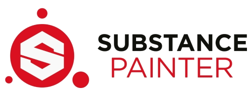

<br>

# PBR SpecGloss Export Setting Presets for BZCC

<br>

## Getting Started

Download the necessary preset files:
- [Height-Normals Preset](BZCC-Height-Normals-Export.spexp)
- [SpecGloss Maps Preset](BZCC-PBR-SpecGloss-Export.spexp)

_These files were made by me, however the information to make and save these presets were given by various BZCC Community Member. Those had prior knowledge with Substance Painter, so all credit is due to them. Thank you to those for sharing the knowledge that has gotten us all this far._

<br>

## Installation and Setup

### Steam Version
- Navigate to the following directory: ```C:\Users\...\Documents\Adobe\Adobe Substance 3D Painter\assets\export-presets```
- Paste **BOTH** `.spexp` files here.
- That's it! They are ready for use.

### Non-Steam Version
- Navigate to the following directory: ```C:\Users\...\Documents\Allegorithmic\Substance Painter\shelf\export-presets```
- Paste **BOTH** `.spexp` files here.
- That's it! They are ready for use.


<br>

## Final Remarks
_(This was demonstrated using the Steam Version)_
