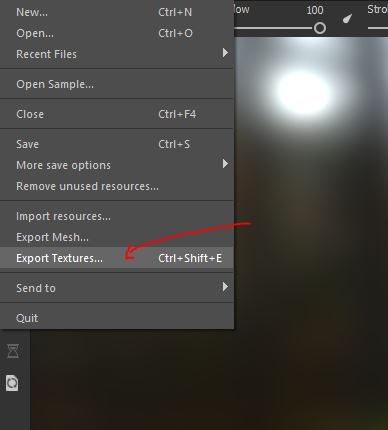
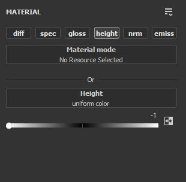
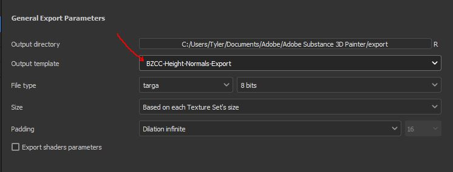
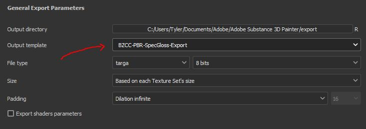

 

<br>

# PBR SpecGloss Export Setting Presets
Here is how to setup Substance Painter PBR SpecGloss Presets designed for **[Battlezone Combat Commander](https://battlezonecombatcommander.com/en)** texture-making.

What are these Export Presets used for?
- Generating a usable Normal Map from the Height Map data (that can be used to bake other texture maps).
- Generating final texture maps, with BZCC PBR SpecGloss properties configured.


A typical SubstancePainter workflow:
- Bake Normal-Maps
- Export Normal-Maps
- Re-Import Normal-Maps
- Bake Texture-Maps (AO, etc)
- Export Textures into BZCC (Diffuse, Normal, SpecGloss, Emissive)

**_The information to make and save these presets were given by various BZCC Community Members. Those had prior knowledge with Substance Painter, so all credit is due to them. Thank you to those for sharing the knowledge that has gotten us all this far._**

<br>

## Getting Started

### Downloading Preset Files:
You can browse or download the specific presets as you wish in the [Releases](https://github.com/LordBramster/BZCC-Substance-Painter-Export-Presets/releases) tab.
Or, you can download them as listed below:
- [Height-Normals Preset](BZCC-Height-Normals-Export.spexp)
- [SpecGloss Maps Preset](BZCC-PBR-SpecGloss-Export.spexp)

<br>

## Installation and Setup

### Steam Version:
- Navigate to the following directory: ```C:\Users\...\Documents\Adobe\Adobe Substance 3D Painter\assets\export-presets```
- Paste **BOTH** `.spexp` files here.

### Non-Steam Version:
- Navigate to the following directory: ```C:\Users\...\Documents\Allegorithmic\Substance Painter\shelf\export-presets```
- Paste **BOTH** `.spexp` files here.

That's it! They are ready for use.


<br>

## Demonstration
_Note: This was demonstrated using the Steam Version_

### Reminder: How to Export
You can export any texture maps via "Export Textures" on the top Toolbar:
- **Select** Export Textures _(ctrl+shift+e)_


### Export Normal-Maps
After you have a Normal-Map, you can export it to bake new texturemaps upon re-import:

- **Select** the field called "Output Template".
- **Choose** `BZCC-Height-Normals-Export`
- When you're ready, **select** "Export".


### Export Textures
After you are done texturing, and want to export all these textures into BZCC:
- **Select** the field called "Output Template".
- **Choose** `BZCC-PBR-SpecGloss-Export`
- When you're ready, **select** "Export".

